<!--
# File: Quick_Start_Guide.md
# Copyright (c) 2021 BG Networks, Inc.
# See LICENSE file for license details.
-->
<p align="center">
    
</p>

# 1. System Requirements

[BG Networks](https://bgnet.works/)' Embedded Security Software Architecture ([ESSA](https://bgnet.works/security-automation-tools-overview/embedded-security-software-architecture/)) is a Yocto-based solution. The build has been tested with `Ubuntu 20.04 (LTS)`. For other supported Linux distributions, please refer to the Yocto Project Reference Manual.

The ESSA is only tested with the [WINSYSTEM ITX-P-C444](https://www.winsystems.com/product/itx-p-c444/) board (imx8mq-itx-p-c444).

**Essentials**: The packages that are needed to build an image on a headless system:

```bash
sudo apt install gawk wget git diffstat unzip texinfo gcc build-essential \
chrpath socat cpio python3 python3-pip python3-pexpect xz-utils debianutils \
iputils-ping python3-git python3-jinja2 libegl1-mesa libsdl1.2-dev pylint3 \
xterm python3-subunit mesa-common-dev zstd liblz4-tool snapd minicom

# Downloading and installing repo tool
curl https://storage.googleapis.com/git-repo-downloads/repo ~/repo
chmod a+x ~/repo
sudo cp ~/repo /usr/bin
```

# 2. Core Image build

#### 1. Create a directory for the ESSA BSP for the ITX-P-C444 board:

```bash
mkdir ~/bgn-essa-c444
cd ~/bgn-essa-c444
```

#### 2. repository initialization

```bash
repo init -u https://github.com/bgnetworks/c444-manifest.git -b master -m itx-p-c444_5.4.47.xml
wget --directory-prefix .repo/manifests https://raw.githubusercontent.com/bgnetworks/meta-bgn-essa/zeus-w-caam/meta-mender-c444/scripts/c444_5.4.47-essa-demo.xml
repo init -m c444_5.4.47-essa-demo.xml
```

#### 3. pull repositories

```bash
repo sync
```

The files and directories that are in the bgn-essa-c444

<p align="left">
    
</p>

The Yocto meta directories that are in the sources

<p align="left">
    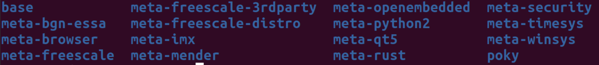
</p>


#### 4. setup the build environment at first time

```bash
MACHINE=imx8mq-itx-p-c444 DISTRO=c444-xwayland source c444-setup-essa.sh -b build
```

#### 5. build core image

```bash
bitbake core-image-base
```

The following build configurations should show up in the terminal:

<p align="left">
    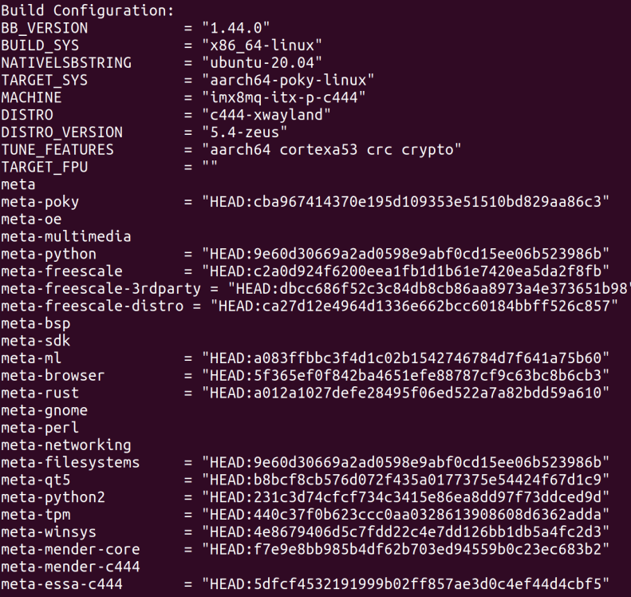
</p>

**Note**: _the image build may take a few hours at the first time_

# 3. Program the images into the board EMMC

#### 1. install uuu tool

```bash
sudo snap install universal-update-utility
```

#### 2. change to the image directory

```bash
cd ~/bgn-essa-c444/build/tmp/deploy/images/imx8mq-itx-p-c444
```

<p align="left">
    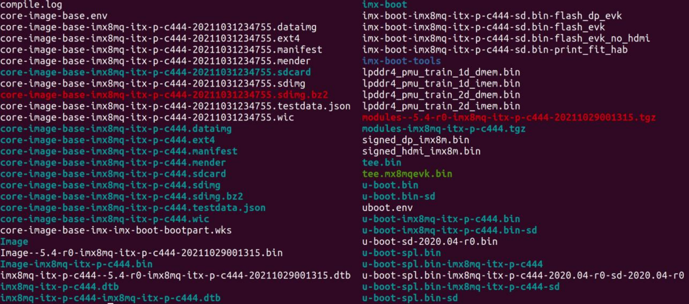
</p>

#### 3. set the `itx-p-c444` board to serial download mode

<p align="left">
    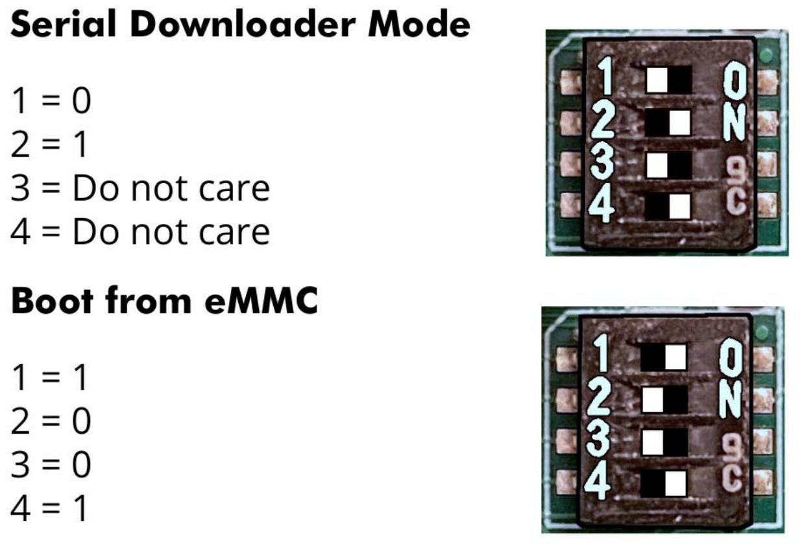
</p>

#### 4. Connect the board (_USB 3.1 Gen 1 connector_) to the build machine with a **USB type A to type A cable**

<p align="left">
    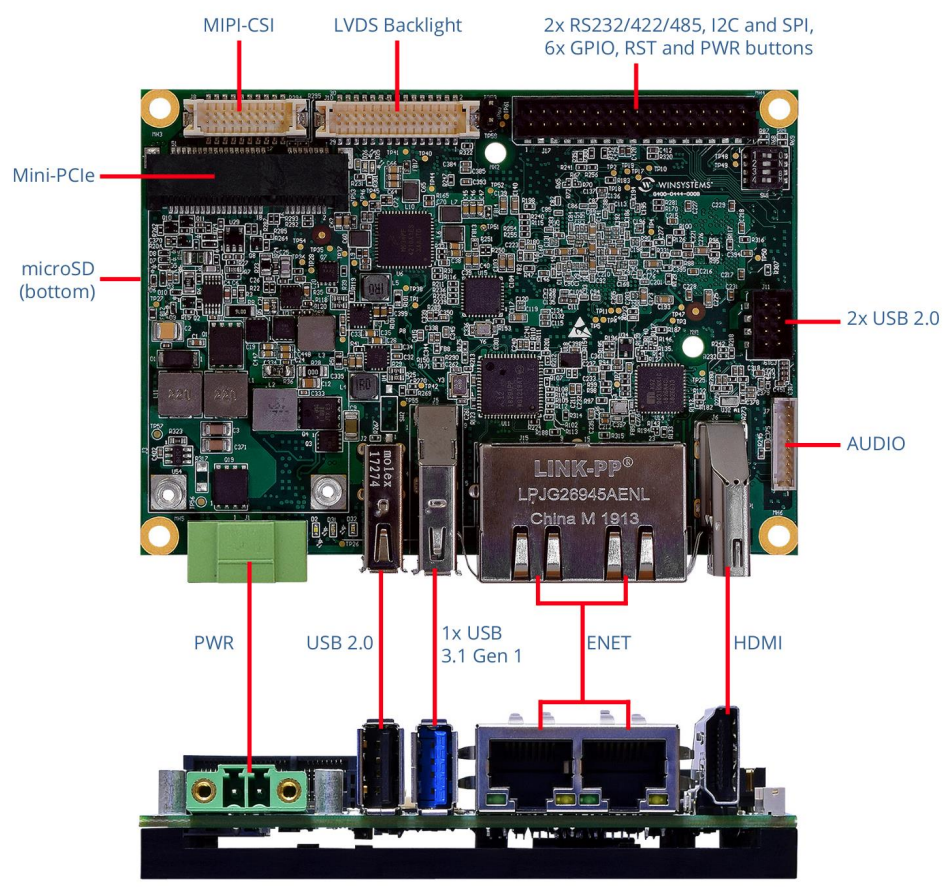
</p>

#### 5. Power up the board

#### 6. Confirm the board has been set up correctly

```bash
uuu -lsusb
```

<p align="left">
    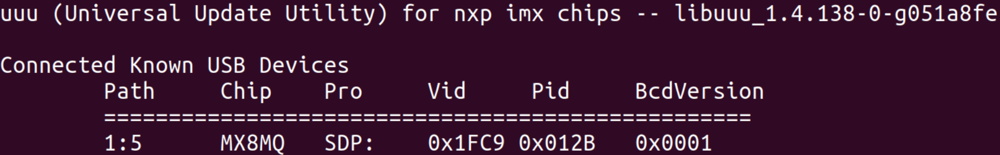
</p>

#### 7. burn the uboot and image

```bash
sudo uuu -b emmc_all imx-boot core-image-base-imx8mq-itx-p-c444.sdimg
```

<p align="left">
    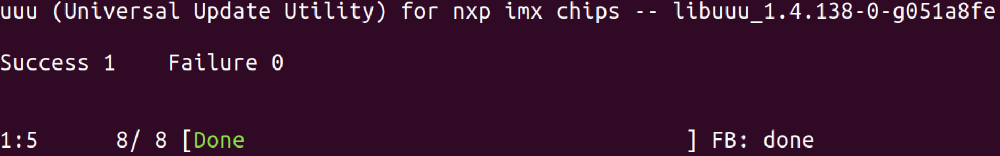
</p>

#### 8. power down the board

#### 9. set the `itx-p-c444` board to the `eMMC` boot mode

# 4. Block encryption example

#### 1. set up minicom

```bash
sudo minicom -s
```

<p align="left">
    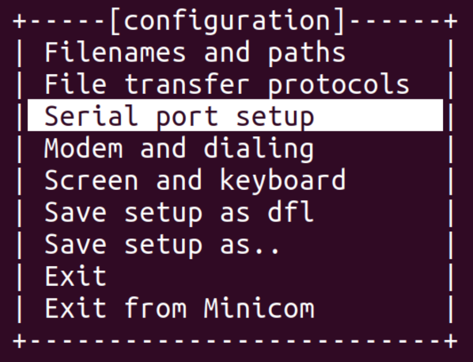
</p>

<p align="left">
    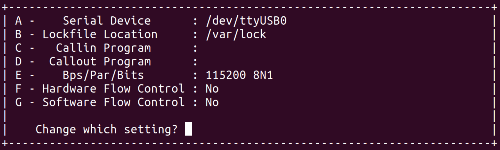
</p>

<p align="left">
    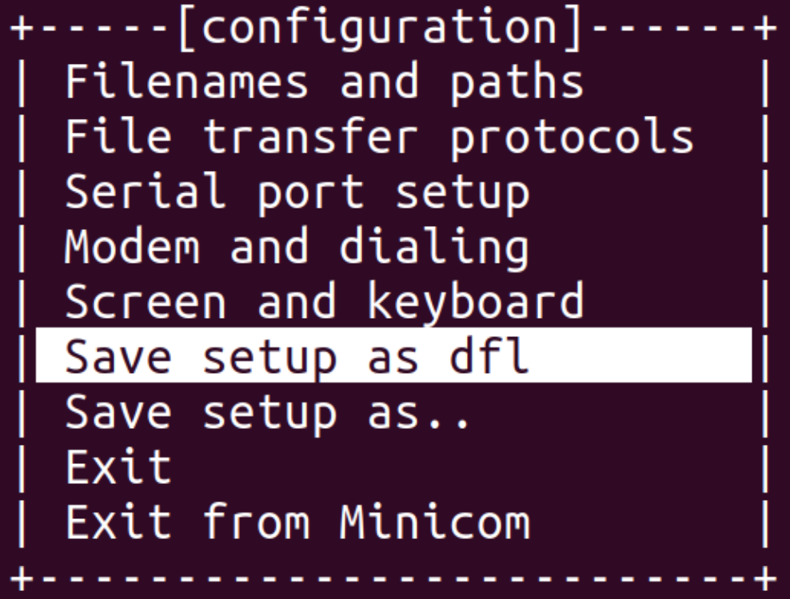
</p>

#### 2. open minicom

```bash
sudo minicom
```

#### 3. connect to the `itx-p-c444` board `J3 - COM PORT 1` with a USB-UART cable

#### 4. power up the `itx-p-c444` board and log in as `root` after booting is completed

#### 5. create a random key

```bash
caam-keygen create mykey ecb -s 16
cd /data/caam
```

<p align="left">
    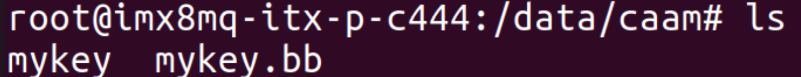
</p>

#### 6. add the key into the Linux keyring

```bash
cat mykey | keyctl padd logon mykey1: @s
```

<p align="left">
    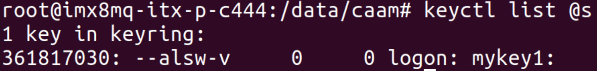
</p>

#### 7. Create a file and link to loop device

```bash
dd if=/dev/zero of=encrypted.img bs=1M count=32
losetup /dev/loop0 encrypted.img
```

#### 8. use the generated random key for block encryption

```bash
dmsetup -v create myEncryptedBlock --table "0 $(blockdev --getsz /dev/loop0) crypt capi:tk(cbc(aes))-plain:36:logon:mykey1: 0 /dev/loop0 0 1 sector_size:512"
```

<p align="left">
    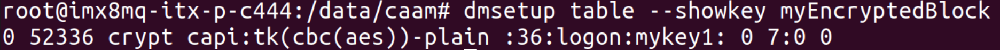
</p>

#### 9. build file system

```bash
mkfs.ext4 /dev/mapper/myEncryptedBlock
```

#### 10. mount the encrypted block

```bash
mkdir -p /mnt/myBlock
mount /dev/mapper/myEncryptedBlock /mnt/myBlock
```

#### 11. create a new file in the encrypted block

```bash
echo "This is a test of disk encryption on i.MX" > /mnt/myBlock/readme.txt
```

#### 12. umount and remove the encrypted block

```bash
umount /mnt/myBlock
dmsetup remove myEncryptedBlock
```

#### 13. power cycle the `itx-p-c444` board and log in as `root` after the booting is completed

#### 14. import the generated random key

```bash
cd /data/caam
caam-keygen import mykey.bb importKey
```

<p align="left">
    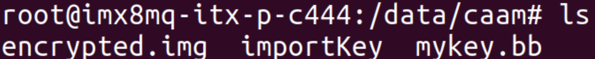
</p>

#### 15. add the key into the Linux keyring

```bash
cat importKey | keyctl padd logon mykey2: @s
```

<p align="left">
    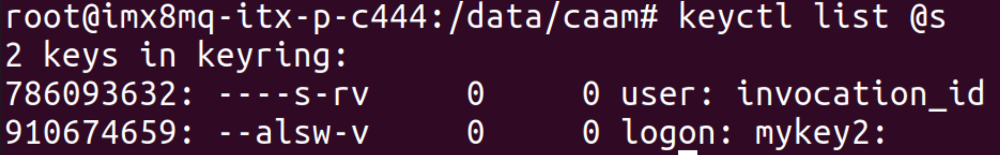
</p>

#### 16. link the file to loop device

```bash
losetup /dev/loop0 encrypted.img
```

#### 17. use the imported key for block encryption

```bash
dmsetup -v create myEncryptedBlock --table "0 $(blockdev --getsz /dev/loop0) crypt capi:tk(cbc(aes))-plain:36:logon:mykey2: 0 /dev/loop0 0 1 sector_size:512"
```

#### 18. mount the encrypted block

```bash
mount /dev/mapper/myEncryptedBlock /mnt/myBlock
```

#### 19. check the readme

<p align="left">
    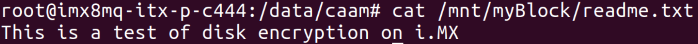
</p>
